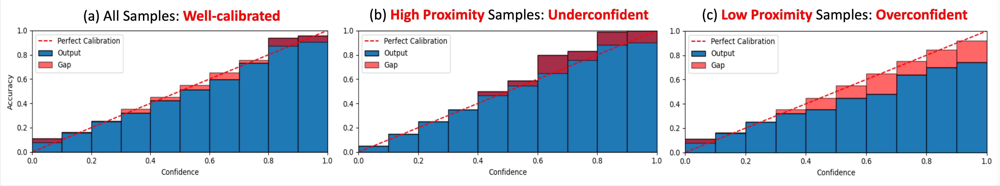
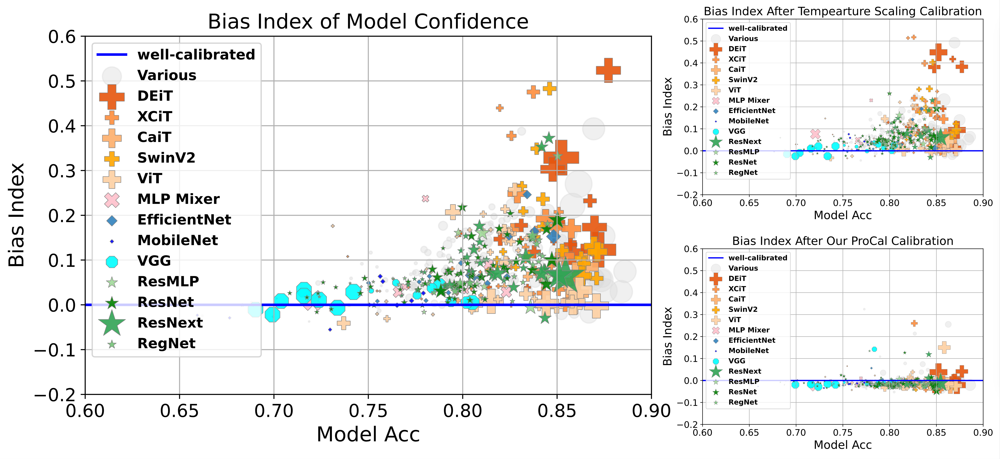

Proximity-Informed Calibration for Deep Neural Networks
==
Code for the paper "Proximity-Informed Calibration for Deep Neural Networks"

Paper: https://arxiv.org/abs/2306.04590  
Authors: [Miao Xiong](https://scholar.google.com/citations?user=yQ4U_5IAAAAJ&hl=en) $^\dagger$, [Ailin Deng](https://d-ailin.github.io/) $^\dagger$, [Pang Wei Koh](https://koh.pw/) $^\ddagger$, [Jiaying Wu](https://scholar.google.com/citations?user=mrfO62wAAAAJ&hl=en) $^\dagger$, [Shen Li](https://github.com/MathsShen) $^\dagger$, [Jianqing Xu](https://openreview.net/profile?id=~Jianqing_Xu1), [Bryan Hooi](https://bhooi.github.io/)$^\dagger$

$^\dagger$ National University of Singapore, $^\ddagger$ University of Washington

## 01 Overview



Confidence calibration is central to providing accurate and interpretable uncertainty estimates, especially under safety-critical scenarios. However, we find that existing calibration algorithms often overlook the issue of proximity bias, a phenomenon where models tend to be more overconfident in low proximity data (i.e., lying in the sparse region of the data distribution) compared to high proximity samples, and thus suffer from inconsistent miscalibration across different proximity samples. We examine the problem over pretrained ImageNet models and observe that: 1) Proximity bias exists across a wide variety of model architectures and sizes; 2) Transformer-based models are more susceptible to proximity bias than CNN-based models; 3) Proximity bias persists even after performing popular calibration algorithms like temperature scaling; 4) Models tend to overfit more heavily on low proximity samples than on high proximity samples. Motivated by the empirical findings, we propose ProCal, a plug-and-play algorithm with a theoretical guarantee to adjust sample confidence based on proximity. To further quantify the effectiveness of calibration algorithms in mitigating proximity bias, we introduce proximity-informed expected calibration error (PIECE) with theoretical analysis. We show that ProCal is effective in addressing proximity bias and improving calibration on balanced, long-tail, and distribution-shift settings under four metrics over various model architectures.




## 02 Setup

```
conda create -n faiss_1.7.3 python=3.8
conda activate faiss_1.7.3
conda install pytorch==1.11.0 cudatoolkit=11.3 -c pytorch
conda install numpy
conda install -c pytorch faiss-gpu=1.7.3 cudatoolkit=11.3
conda install -c conda-forge notebook
conda install -y matplotlib
```

```
pandas
statsmodel
KdePy
seaborn
scipy
```


## 03 Our Method: Density-Ratio Calibration and Bin Mean-Shift

In this paper, we primarily introduce two methodologies: Density-Ratio Calibration and Bin Mean-Shift (refer to Section 5.1 and 5.2 in the paper, respectively). Density-Ratio Calibration focuses on estimating continuous density functions, aligning itself seamlessly with calibration methods that yield continuous confidence scores (e.g., scaling-based method). On the other hand, Bin Mean-Shift does not depend on density estimations, proving itself more suitable for calibration methods producing discrete outcomes (e.g., binning-based method).

### Selecting the Appropriate Method

The choice between Density-Ratio Calibration and Bin Mean-Shift depends on several factors:

1. Do you need to integrate with existing calibration methods?

**Yes**: the choice of method depends on the calibration techniques in use. Opt for Density-Ratio Calibration if you're utilizing scaling-based algorithms or those generating continuous confidence scores within the [0, 1] range. For methods like binning-based ones, where the confidence outputs are discretely valued, Bin Mean-Shift is advisable.

**No**: If there's no need to combine with existing calibration methods and you're directly applying our algorithms for confidence calibration, both methods are applicable.

### Density-Ratio Calibration

Our approach is encapsulated within the `DensityRatioCalibration` class, as demonstrated below:

```python
from utils.density_estimation_calibration import DensityRatioCalibration

DER_calibrator = DensityRatioCalibration()
DER_calibrator.fit(val_prob_vector, val_preds, val_ys, val_proximities)
prob_calibrate_test = DER_calibrator.predict(test_prob_vector, test_proximities)
```

The `DER_calibrator.fit()` method requires parameters like `probs`, `preds`, `ys`, and `proximity`:

| Argument     | Description                                                  |
| ------------ | ------------------------------------------------------------ |
| `--probs`    | The model/calibration algorithm's output confidence vector for all classes (shape [samples, classes]). |
| `--preds`    | Predicted classes for each sample (shape [samples, ]).       |
| `--ys`       | Actual labels (shape [samples,]).                            |
| `--proximity`| Exponential function of the negative average distance to K nearest neighbors (shape [samples,]). |

### Bin-Mean-Shift

The Bin-Mean-Shift methodology is primarily encapsulated in the `BinMeanShift()` class, serving as a plug-and-play, proximity-informed solution for binning calibration methods (e.g., isotonic regression). It's typically used in conjunction with existing methods outputting discrete values. The process primarily involves:

1. Utilizing proximity to categorize data into several bins.
2. Employing a binning-based calibration algorithm (e.g., multi-isotonic-regression) to calibrate within each bin.

Usage example:

```python
from utils.multi_proximity_isotonic import BinMeanShift
from utils.ensemble_temperature_scaling import MultiIsotonicRegression
from netcal.binning import IsotonicRegression, HistogramBinning

# Select method based on the calibration requirement
if method == 'histogram_binning':
    calibrator = BinMeanShift('histogram_binning', HistogramBinning, bin_strategy='quantile', normalize_conf=False, proximity_bin=proximity_bin, bins=10)
elif method == 'isotonic_regression':
    calibrator = BinMeanShift('isotonic_regression', IsotonicRegression, bin_strategy='quantile', normalize_conf=False, proximity_bin=proximity_bin)
elif method == 'multi_isotonic_regression':
    calibrator = BinMeanShift('multi_isotonic_regression', MultiIsotonicRegression, bin_strategy='quantile', normalize_conf=False, proximity_bin=proximity_bin)

# Calibration process
prob_reg_val = calibrator.fit_transform(val_logits, val_knndists, val_ys)
prob_reg_test = calibrator.transform(test_logits, test_knndists)
```

Corresponding parameter explanations are:

| Argument     | Description                                                  |
| ------------ | ------------------------------------------------------------ |
| `--probs`    | The model/calibration algorithm's output confidence vector for all classes (shape [samples, classes]). |
| `--preds`    | Predicted classes for each sample (shape [samples, ]).       |
| `--ys`       | Actual labels (shape [samples,]).                            |
| `--proximity`| Exponential function of the negative average distance to K nearest neighbors (shape [samples,]). |


## 04 Evaluation Experiments

Our approach adopts a post-hoc method, necessitating a validation set to train the corresponding calibrator and a test set to evaluate the model's performance.
To calibrate every sample, we first need to compute this sample's proximity, defined as the function of the average distance to its surrounding K neighbors (where K=10). In our implementation, the similarity calculation is based on the Euclidean distance within the embedding space. We first acquire the feature embeddings corresponding to each sample to facilitate subsequent computations. 

### 1. Computing Feature Embeddings for Data

In our specific implementation, to streamline further calculations, we precompute essential information for each sample. This information includes the sample's label (`ys`), the model's prediction (`preds`), the feature embedding from the penultimate layer (`zs`), as well as both the logits before the softmax layer and the confidence scores after softmax (`confs`). During the later stage, we retrieve these pieces of information by calling the following function:

```python
ys, zs, logits, confs, preds = pickle.load(open(os.path.join(args.data_dir, 'out_{}.p'.format(args.model)), 'rb'))
```

#### Efficient Embedding Computation Using Timm Models

we provide scripts regarding `ImageNet/ImageNet-Sketch/ImageNet-C` datasets that utilizes models from the Timm library (https://github.com/huggingface/pytorch-image-models) as backbone models to facilitate the calculation of various parameters (`ys`, `zs`, `logits`, `confs`, `preds`). 
```bash
bash scripts/scripts/precompute_intermediate_results_imagenet.sh
bash scripts/precompute_imagenet_sketch.sh
bash scripts/precompute_imagenet_c.sh
```

##### Script Arguments

When executing the script, the following arguments can be customized as demonstrated in the table below:

| Argument       | Example                        | Description                                                  |
| -------------- | ------------------------------ | ------------------------------------------------------------ |
| `data_dir`   | `/your/path/to/imagenet`       | Specifies the directory of the dataset.                      |
| `output_dir` | `intermediate_output/imagenet_train` | Specifies the path where intermediate embeddings and related data will be stored. |
| `model`      | `vit_small_r26_s32_224`        | Indicates the backbone model to be calibrated and employed for generating embeddings. See timm's page (https://github.com/huggingface/pytorch-image-models) for its supported models. |
| `split`      | `val`                          | Specifies the specific split of the dataset we want to use. The split name should be the folder name where the dataset is stored. Here, the terms 'train,' 'val,' and 'test' refer to the names of distinct split folders within the ImageNet directory. |


### 2. Evaluation for Our Method and Baselines

To run this code, the user can run this script:
```bash
bash scripts/compute_calibration_metrics_table_trainknn.sh
```

The script mainly executes the python file `compute_calibration_metrics.py`, which loads previously computed embeddings, and calculates the 'proximity' for each individual sample. Subsequently, it calls various calibration algorithms to acquire calibrated confidence scores. The script further integrates our methodology with existing calibration algorithms to remove their proximity bias. Then it computes the calibration performance for each algorithm and assesses the performance gain of our method.

Our procedure evaluates the performance of the following calibration methods:
- Confidence (conf)
- Temperature Scaling (temperature_scaling)
- Parameterized Temperature Scaling (pts)
- Parameterized Neighbor-Aware Temperature Scaling (pts_knndist)
- Ensemble Temperature Scaling (ensemble_ts)
- Histogram Binning (histogram_binning)
- Isotonic Regression (isotonic_regression)
- Multi-Isotonic Regression (multi_isotonic_regression)

A direct performance comparison between our method and these existing algorithms can be observed through their respective performance metrics, as well as the performance of our methodology combined with confidence ('conf') metrics. 

Users have the flexibility to alter the `compare_methods` dictionary as shown below, enabling control over the choices of baselines they wish to compute:
```python
compare_methods = ['conf', 'temperature_scaling', 'pts', 'pts_knndist', 'ensemble_ts', 'multi_isotonic_regression', 'histogram_binning', 'isotonic_regression']
```

Execution of this script requires the provision of the following parameters:

| Argument          | Example           | Description   |
| ----------------- | ----------------- | ------------- |
| `--dataset_name`  | `imagenet` | The specific dataset intended for use. |
| `--data_dir`      | `intermediate_output/imagenet/` | The designated path for storing intermediate embeddings of the precomputed dataset. |
| `--normalize`     | `True` | Indicates whether to normalize the embedding space. |
| `--num_neighbors` | `10` | The number of neighbors utilized for proximity calculation. |
| `--random_seed`   | `2023` | Any preferential number ensuring consistent results across trials. |
| `--distance_measure` | `L2` | The metric adopted for neighbor distance calculations. Options include "L2," "cosine," "IVFFlat," and "IVFPQ." Refer to 'faiss' for detailed distance definitions. |
| `--model`         | `ResNet50` | Specifies the desired model, with current support limited to models from `timm`. For computations involving alternative models, please refer to our variant scripts such as `compute_calibration_metrics_nlp.py` or `compute_calibration_metrics_distribution_shift.py`. |

### Reproducibility


For iNaturalist 2021, the pretrained model is downloaded from this repo: https://github.com/visipedia/newt 
The evaluation pipeline is obtained by executing the following script:
```bash
bash scripts/compute_calibration_metrics_inaturalist.sh
```

For ImageNet-Sketch:
```bash
bash scripts/precompute_imagenet_sketch.sh
bash scripts/compute_calibration_metrics_imagenet_sketch.sh
```


## Reference Repositories
- Timm: [https://github.com/lm-sys/FastChat](https://github.com/huggingface/pytorch-image-models)
- Faiss: [https://github.com/XiangLi1999/ContrastiveDecoding](https://github.com/facebookresearch/faiss)
- net:cal Uncertainty Calibration: [https://github.com/sylinrl/TruthfulQA](https://github.com/EFS-OpenSource/calibration-framework)


## Citation
Please cite the following paper when you find our paper or code useful. 
```
@inproceedings{xiong2023proximitybias,
    title={Proximity-Informed Calibration for Deep Neural Networks},
    author={Miao Xiong, Ailin Deng, Pang Wei Koh, Jiaying Wu, Shen Li, Jianqing Xu, Bryan Hooi},
    booktitle={Thirty-seventh Conference on Neural Information Processing Systems},
    year={2023},
    url={https://openreview.net/forum?id=xOJUmwwlJc}
}
```
